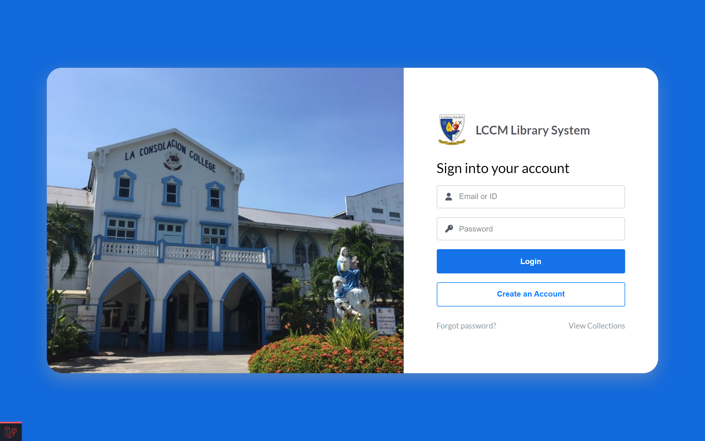
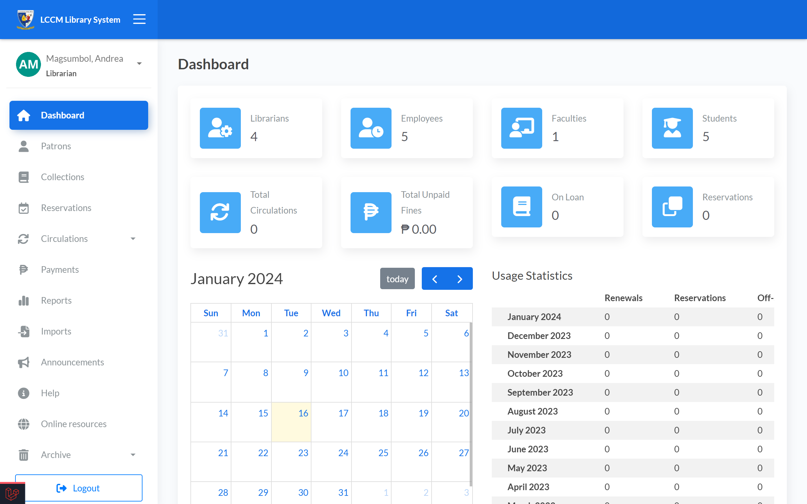
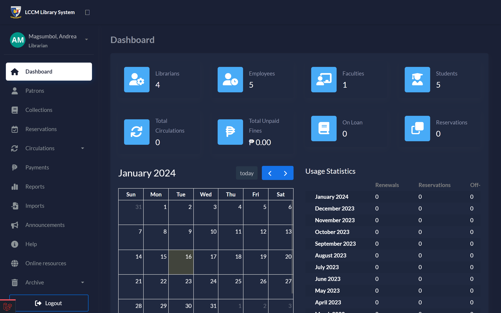
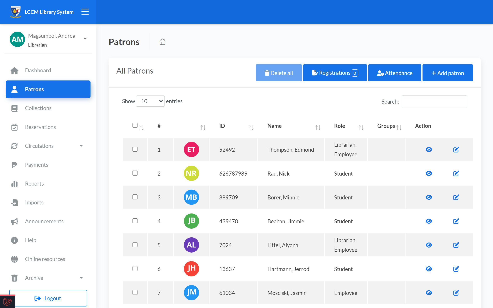
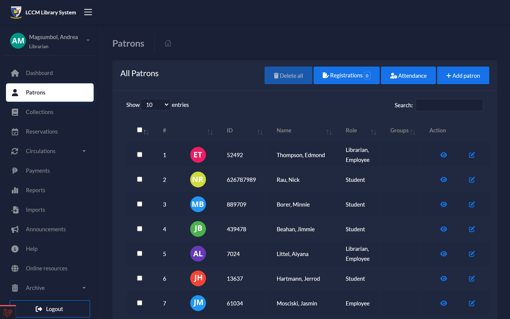

# LCCM Library System

Ranked 2nd place for Best Thesis in IT. The project includes handy features like automatic fine calculations, easy book setup using Google Books, night mode, and attendance and barcode functions.

## Screenshots

## 🚀 About Me

Aspiring Backend developer with an IT degree, proficient in PHP (Laravel), CSS (Bootstrap), and JavaScript. Expert in API integration and database management, showcasing strong problem-solving skills. Passionate about continuous learning and adaptable to emerging technologies. Let's code the future! 🚀💻

## Acknowledgements

-   [Atlantis Bootstrap Admin Template](https://themekita.com/demo-atlantis-lite-bootstrap/)
